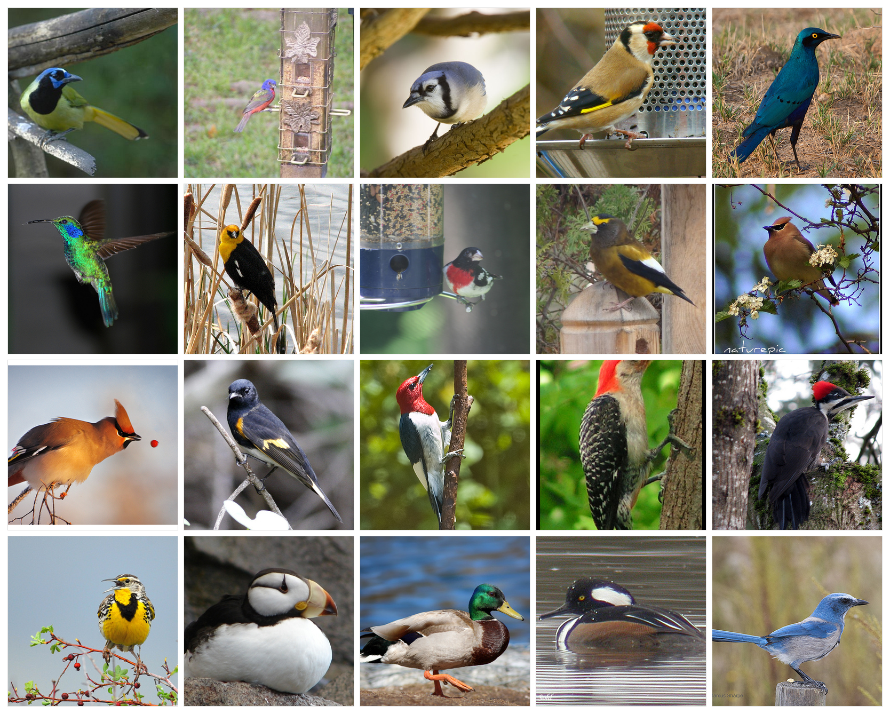
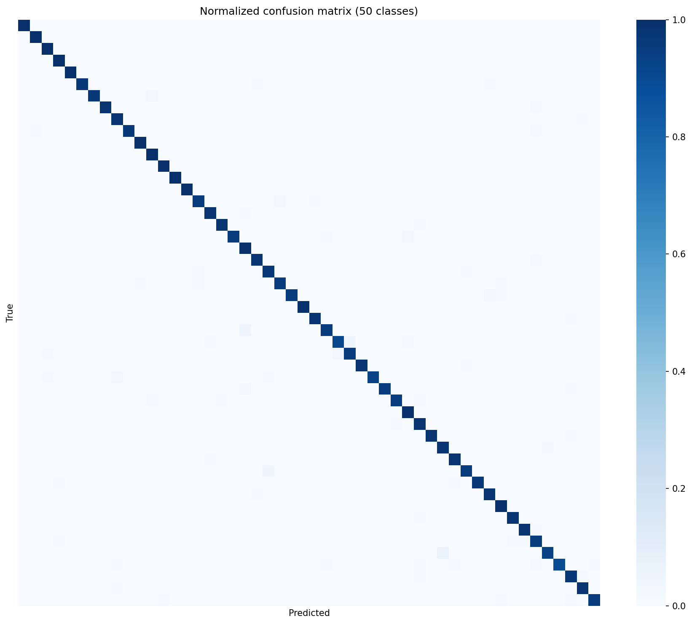
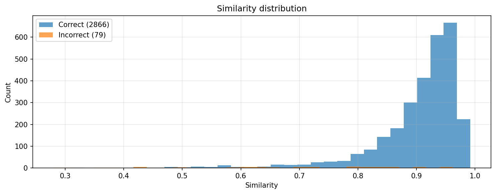

# Siamese Network for Fine-Grained Image Classification

This repo trains a convolutional network to embed images into a space where pictures of the
same class end up close together and different classes end up far apart. Instead of a fixed
softmax classifier, classification is done by comparing an image's embedding against a small
"gallery" of class prototypes. The practical upshot is that adding a new class only means
adding a few reference images to the gallery — you don't have to retrain the network.

I built it to work on fine-grained problems, where the classes look almost identical and a
plain classifier tends to struggle. The reference dataset is **CUB-200-2011** (200 species of
birds); the experiment reported below runs on a **50-class subset** (see
[Dataset](#dataset)). Any dataset laid out as one folder per class will work.

## How it works

The pipeline has four parts:

1. **Embedding network.** A ResNet-34 pretrained on ImageNet, with the classification head
   replaced by a small projection head. The output is L2-normalized so cosine similarity is
   just a dot product. BatchNorm is kept frozen during fine-tuning, which is more stable when
   you train with small, class-balanced batches.

2. **Metric learning.** Training uses a **triplet loss with online hard mining**: within each
   batch, every anchor is paired with its hardest positive (same class, farthest away) and its
   hardest negative (different class, closest). To make those triplets meaningful, batches are
   sampled to always contain a fixed number of classes with a fixed number of images each.

3. **Gallery classification.** After training, I average the embeddings of each class into a
   prototype (with light outlier filtering and optional PCA), and classify a new image by its
   cosine similarity to the nearest prototype. A similarity threshold lets the model answer
   "unknown" instead of forcing a guess, which is useful in open-set settings.

4. **Evaluation.** `scripts/evaluate.py` classifies a whole folder against the gallery and
   reports per-class precision/recall/F1 and overall accuracy (as both a text report and a
   CSV), plus a confusion matrix and a similarity-distribution plot.

Other bits worth mentioning: warmup + cosine LR schedule, early stopping, a stratified
train/val/test split, and retrieval metrics (Recall@K, mAP) rather than only accuracy.

## Dataset

CUB-200-2011 ships with 200 bird species. To keep the experiment simple, this repo uses a
**subset of 50 classes** (folders renumbered `001`–`050`). The layout the code expects is one
subfolder per class:

The dataset images themselves are **not** included in this repo. The 50 selected classes are:

<details>
<summary>The 50 classes (click to expand)</summary>

| # | Class | # | Class |
|---|---|---|---|
| 001 | White_breasted_Kingfisher | 026 | Western_Meadowlark |
| 002 | Cape_Glossy_Starling | 027 | Cerulean_Warbler |
| 003 | Green_Jay | 028 | Bohemian_Waxwing |
| 004 | Spotted_Catbird | 029 | Cedar_Waxwing |
| 005 | Least_Auklet | 030 | Downy_Woodpecker |
| 006 | Mallard | 031 | Blue_Jay |
| 007 | European_Goldfinch | 032 | Pied_Kingfisher |
| 008 | Rose_breasted_Grosbeak | 033 | Yellow_headed_Blackbird |
| 009 | Florida_Jay | 034 | Clark_Nutcracker |
| 010 | Green_Violetear | 035 | Bobolink |
| 011 | Brown_Creeper | 036 | Tropical_Kingbird |
| 012 | Evening_Grosbeak | 037 | White_Pelican |
| 013 | Horned_Lark | 038 | Green_tailed_Towhee |
| 014 | Heermann_Gull | 039 | Pileated_Woodpecker |
| 015 | Horned_Puffin | 040 | Painted_Bunting |
| 016 | Red_bellied_Woodpecker | 041 | Red_breasted_Merganser |
| 017 | Golden_winged_Warbler | 042 | Gray_crowned_Rosy_Finch |
| 018 | Red_winged_Blackbird | 043 | Purple_Finch |
| 019 | White_breasted_Nuthatch | 044 | American_Redstart |
| 020 | Black_and_white_Warbler | 045 | Bay_breasted_Warbler |
| 021 | Gadwall | 046 | Brown_Pelican |
| 022 | Red_headed_Woodpecker | 047 | Black_throated_Blue_Warbler |
| 023 | Northern_Flicker | 048 | Scissor_tailed_Flycatcher |
| 024 | Hooded_Merganser | 049 | Tree_Swallow |
| 025 | Black_throated_Sparrow | 050 | Dark_eyed_Junco |

</details>

### Example images

A sample of 25 of the 50 target species from CUB-200-2011:



## Results

Metrics below are measured **on the 50-class subset** (2,945 images), classifying every image
against the prototype gallery. Backbone ResNet-34, 512-d embeddings reduced to 128-d with PCA.

| Metric | Value |
|---|---|
| Gallery top-1 accuracy | **97.3 %** |
| Weighted-averaged precision | **0.974** |
| Weighted-averaged recall | **0.973** |
| Weighted-averaged F1 | **0.973** |
| Images evaluated | 2,945 across 50 classes |

Per-class precision/recall/F1 are written to `checkpoints/evaluation/classification_report.csv`.




**Training details:** ResNet-34 backbone, early-stopped at epoch 8 (best val loss 0.192),
batch geometry `8 classes x 4 samples`, base LR `1e-4`, triplet margin `0.3`. See
`configs/cub200.yaml` for the full configuration.

## Setup

```bash
git clone https://github.com/tricio91/SiameseNetwork.git
cd SiameseNetwork
pip install -e .
```

Get the CUB-200-2011 dataset from the
[Caltech Vision page](https://www.vision.caltech.edu/datasets/cub_200_2011/) and point
`data_dir` in `configs/cub200.yaml` at its `images/` folder (one subfolder per species).
Any other dataset works too, as long as it's organized the same way:

```
data/
  class_a/  img1.jpg img2.jpg ...
  class_b/  img1.jpg img2.jpg ...
  ...
```

The trained weights and the dataset are **not** committed;
reproduce the backbone with `scripts/train.py` on your own copy of the data.

## Usage

```bash
# 1. Train the embedding network (skipped automatically if a checkpoint already exists)
python scripts/train.py --config configs/cub200.yaml

# 2. Build the gallery of class prototypes from the trained model
python scripts/build_gallery.py --config configs/cub200.yaml

# 3. Evaluate the whole image folder: metrics + confusion matrix + similarity plots
python scripts/evaluate.py --config configs/cub200.yaml
#    add --no-show to save the plots without opening windows

# 4. Classify a single image
python scripts/predict.py --image path/to/bird.jpg --config configs/cub200.yaml
```

Or use the package directly:

```python
from siamese import Config, build_model, build_dataloaders, fit, get_device

cfg = Config.from_yaml("configs/cub200.yaml")
device = get_device()
loaders = build_dataloaders(cfg)
model = build_model(cfg, device)
fit(model, loaders, cfg, device)
```

## Project layout

```
src/siamese/
  config.py       # all hyperparameters in one dataclass (YAML-loadable)
  model.py        # SimpleEmbeddingNet: ResNet-34 + projection head
  losses.py       # triplet loss with hard mining
  data.py         # transforms, dataset, balanced sampler, stratified split
  training.py     # optimizer, LR schedule, train loop, checkpoints
  metrics.py      # embedding extraction, Recall@K, mAP
  gallery.py      # PCA, prototypes, outlier filtering, classification
  evaluation.py   # gallery evaluation, per-class report/CSV, plots
scripts/          # train / build_gallery / evaluate / predict entry points
configs/          # experiment configs
docs/             # figures used in this README
```

## License

MIT.
CUB-200-2011 is distributed for non-commercial research.

